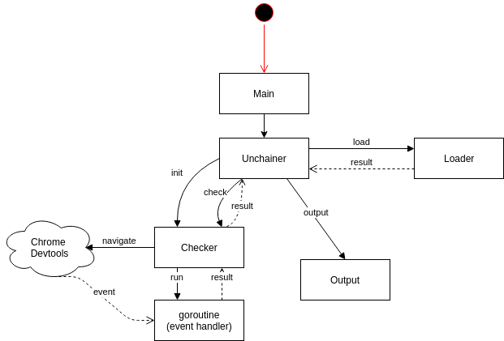

Clickky task
======

Disclaimer: this is my first real Go code :)

Usage
------

Environment variables are used instead of CLI arguments to simplify the work with Docker.

- `CHROME_URL` variable is required and should contain URL to headless chrome devtools;
- `INPUT_FILE` variable is required and should contain path to file with input data - either network-served or real filesystem (via volumes);
- `LOG_FILE` variable is optional and could contain a path to log file (an example volume is present on docker-compose.yml);
- `QUIET_MODE` variable is optional; if it is set to `true` - there would be no stdout output. 

All these parameters are passed to main `Unchainer` package.

Structure
------

Project structure is pretty simple - it consists of 2 Docker images. 

Headless Chrome version should be fixed to that in docker-compose file since there was a fix after that version which requires that all the requests to Devtools endpoint should contain `Host` header with either IP or `localhost`.

It is possible to get deeper to override default host to provide Docker compatibility but this would take more time and I didn't want to mess with lower-level code here.

Architecture
------

####Main logic

The package is implemented separately and contains two methods to do the real work: one loads data automatically and another works with already prepared data.

Now it is bundled as a local package because I didn't want to violate DevChallenge rules and publish it on Github.

I've decided to use stateful object-like structures and methods on those structures to keep all the dependencies in one place and to be able to free used resources afterwards.

`Unchainer` struct provides a wrapper for `Checker` struct. Latter one does all the job - it communicates with Headless Chrome and handles required events composing a list of all redirects which happen (taking `redirectInterval` constant into account).

`redirectInterval` constant was set basing on provided test files.

`Checker` struct initializes connection to Chrome Devtools and also enables and initializes event listeners.
Also it initializes data channels for goroutines and provides a `Close` method which should be used to free used resources afterwards.

`Check` method creates channels for results and communication (`recv` and `done` channels respectively) and navigates to start page.
 
After that Chrome would start all the routine of navigating across the pages via redirects, which would be collected by `RequestWillBeSent` and `ResponseReceived` event handlers.
`RequestWillBeSent` handles server redirects (301 response code and Location header) and `ResponseReceived` handles HTML and JS redirects.

Collected results from goroutine running the event handlers are passed via `recv` channel to `Check` method and collected into `Result.Chain` struct.

If redirect timeout has passed - goroutine notifies main thread via `done` channel.

`Close` method on `Checker` struct frees all the resources and notifies all the goroutines to stop via `destroyChecker` channel.

I tried the `WaitGroup` approach but it is not so useful here since we do not know how much "runs" to wait for.

`abortOnErrors` method creates 2 additional event handlers which would be called when something goes wrong. These would notify another goroutine started in `InitChecker` method which would perform actions accordingly.

####Output

`Output` module is pretty straightforward: it relies on `quietMode` and `logFile` parameters and creates `Log` instance if needed. Also it contains methods to output data with predefined messages.

####Loader

`Loader` module is also pretty straightforward: it decides whether input path is a filesystem path or an URL and loads the data accordingly. After that received JSON is unmarshaled into `InputData` struct.

####Types

`Types` module contains generic structs used across the app.

`InputData` struct represents provided JSON structure.

`Link` struct is a custom type used to transform a string to `url.URL` to use it in navigation.

`Result` struct contains result data received from Checker.

####Testing

Unfortunately it took me too much time to handle Docker and Chrome issues (one described in Structure section) so I didn't have enough time to write any tests.

If I had enough time I would do the following:
1. test for `Loader` module:
    * Unmarshaling of data (valid & invalid input);
    * Filesystem abstraction (maybe using https://github.com/spf13/afero);
    * Network abstraction
2. test for `Output` module:
    * Filesystem abstraction (log file writing)
    * Stdout write test (though I haven't found a package for this)

IMO tests for `Unchainer` module and `Checker` module are not necessary since they communicate with Chrome which can't be mocked good enough. 
Nevertheless some parts of that code could be tested after some architecture improvements (see Improvements section).

###Improvements

Below is UML-like diagram of the application.

It actually describes all the text above.

Main improvement points:
1. modularize the application to be able to replace `Loader` and `Output` easier;
2. make working with goroutines more transparent and avoid implicit channel communication;
3. get deeper into Devtools module to be able to work with latest Chrome version;
4. (if necessary) fully parallelize work with Chrome Devtools - open tabs and find out some way to identify events to treat them according to tabs they belong to.